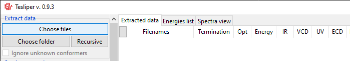
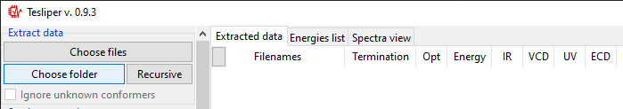
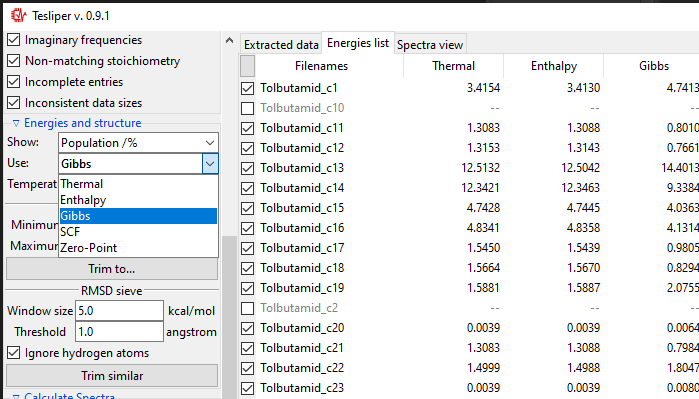
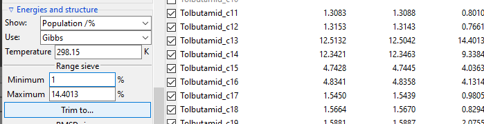
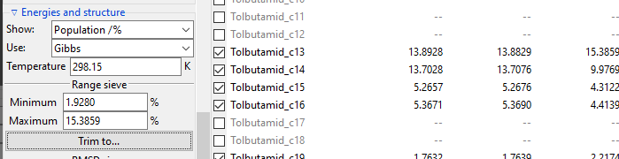
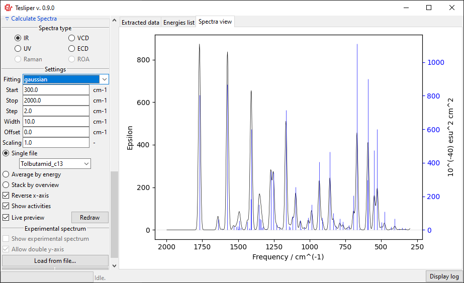
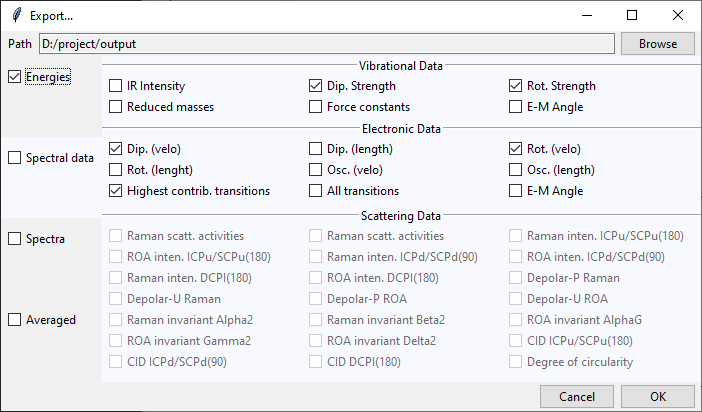

Graphical Interface
===================

This part discusses the use of the Graphical User Interface (GUI). For tutorial on using
``tesliper`` in Python scripts, see :ref:`tutorial`.

On Windows system you may start the GUI by downloading and double-clicking
``Tesliper.exe`` file available in the `latest release
<https://github.com/mishioo/tesliper/releases/latest/>`_, as described in the
:ref:`Installation section <install-gui>`. Executable files are not available for other
systems, unfortunately, but you may start the GUI from the command line as well:

.. code-block:: bash

    $ python -m pip install tesliper[gui]  # only once
    $ python -m tesliper.gui  # starts GUI

Please note that the first launch may take additional time. After the application
starts, a window like the one bellow will appear. It's actual looks will depend on your
operating system. 

.. image:: _static/screenshots/16426971762.png

The Interface is divided in two parts: controls on the left and views (initially empty)
on the right. Controls panel are further divided into sections, some of which may be
collapsed by clicking on the section title (those with a small arrow on the left).
Each section will be described further in this tutorial, in the appropriate section.

There are tree views available: ``Extracted data`` and ``Energies list`` summarize all
conformers read from files. ``Extracted data`` details what data is available and shows
status of calculations for each conformer. ``Energies list`` shows values of conformers'
energies calculated by quantum chemical software and derived values: Boltzmann factors
and conformers' populations.

Reading files
-------------

``tesliper`` supports reading data from computations performed using Gaussian software.
To load data, use controls in the ``Extract data`` section. ``Choose files`` button
allows you to select individual files to read using the popup dialog. ``Choose folder``
button shows a similar dialog, but allowing you to select a single directory - all
Gaussian output files in this directory (but not subdirectories) will be read.

.. note::

    Make sure you do not have mixed .log and .out files in the directory, when using
    ``Choose folder`` button.

Once you select files or directory and confirm your selection, the process of data
extraction will start and ``Extract data`` view will be updated for each read conformer.
It will show if calculation job terminated normally (``Termination``), if conformer's
structure was optimized and if optimization was successful (``Opt``), if extended set of
energies is available (``Energy``), what spectral data it available (``IR``, ``VCD``,
``UV``, ``ECD``, ``Raman``, ``ROA``), how many imaginary frequencies are reported for
conformer (``Imag``), and what is conformer's stoichiometry (``Stoichiometry``).

When data extraction is finished, the status barr att the bottom will show ``Idle``
again. After reading first portion of files, you may tick the ``Ignore unknown
conformers`` option. When this option is ticked, ``tesliper`` will only read files that
correspond to conformers it already knows (judging by the filename).

Trimming conformers
-------------------

Conformers may be marked as :term:`kept` :term:`not kept <kept>` (:term:`trimmed
<trimming>`). Only :term:`kept` conformers are processed by ``tesliper``,
:term:`trimmed <trimming>` ones are ignored. This mechanism allows you to select which
conformers should be included in the final averaged spectrum, etc. Trimmed conformers
are shown in gray.

``Kept conformers`` section shows how many conformers contain certain data and allows to
easily keep/trim whole groups of conformers, using ``keep`` and ``trim`` buttons beside
the appropriate group. You may also keep/trim individual conformers by ticking/unticking
checkboxes beside the conformers name (left of ``Filenames`` column).

After finished data extraction and after each manual trimming, auto-trimming is
performed to make sure corrupted or invalid conformers are not accidentally
:term:`kept`. Checkboxes in the ``Auto-trim`` subsection, shown below, control which
conformers should be always trimmed.

.. tip::

    ``Incomplete entries`` are conformers that miss some data, which other conformers
    include, e.g. those that were left out in one of calculations steps. ``Inconsistent
    data sizes`` indicates that some multi-value data has different number of data
    points than in case of other conformers. This usually suggests that conformer in
    question is not actually a conformer but a different molecule.

Trimming with sieves
--------------------

The ``Energies and structure`` section, described in this part, is related with the
``Energies list`` view. This view shows, as the name suggests, list of energies for each
conformer and energies-derived values.

Using a ``Show:`` drop-down menu you may select a different energies-derived data to
show in the view. ``Delta`` is conformer's energy difference to the most stable
(lowest-energy) conformer (in :math:`\mathrm{kcal}/\mathrm{mol}` units), ``Min.
Boltzmann factor`` is conformer's Boltzmann factor in respect to the most stable
conformer (unitless) and ``Popuation`` is population of conformers according to the
Boltzmann distribution (in perecnt). Original ``Energy`` values are shown in Hartree
units.

Both types of sieves provided depend on the selected value of the ``Use:`` drop-down
menu. It determines, which energy values are used by the sieves. Only available energies
wil be shown in the list. In case their names are not intuitive enough, here is the
explanation:

| ``Thermal``: sum of electronic and thermal Energies;
| ``Enthalpy``: sum of electronic and thermal Enthalpies;
| ``Gibbs``: sum of electronic and thermal Free Energies;
| ``SCF``: energy calculated with the self-consistent field method;
| ``Zero-Point``: sum of electronic and zero-point Energies.

The ``Range sieve`` lets you to trim conformers that have a current ``Show:`` value
outside of the specified range. After you fill the ``Minimum`` and ``Maximum`` fields to
match your needs, click ``Trim to...`` button to perform trimming. The example below
shows trimming of conformers, which Free Energy-derived population is below 1%. Please
note that valuesin the ``Energies list`` are recalculated and ``Minimum`` and
``Maximum`` fields are updated to show real current max and min values.

The ``RMSD Sieve`` lets you mathematically compare structures of conformers and trim
duplicates and almost-duplicates. RMSD stands for root-mean-square deviation of atomic
positions and is a conformers similarity measure. The sieve calculates the average
distance between atoms of two conformers and trims the less stable (higher-energy)
conformer of the two, if the resulting RMSD value is smaller than value ot the
``Threshold`` field.

Calculating an RMSD value is quite resource-costly. To assure efficient trimming, each
conformer is compared only with conformers inside its energy window, defied by the
``Window size`` filed value. Conformers of energy this much higher or lower are
automatically considered different.

.. image:: _static/screenshots/16426977988.png

Temperature of the system
-------------------------

The ``Energies and structure`` section also allows you to specify the temperature
of the studied system. This parameter is important for calculation of the Boltzmann
distribution of conformers, which is used to estimate conformers' population
and average conformers' spectra. The default value is the room temperature,
expressed as :math:`298.15\ \mathrm{Kelvin}` (:math:`25.0^{\circ}\mathrm{C}`).
Changing this value will trigger automatic recalculation of ``Min. Boltzmann factor``
and ``Population`` values, and average spectra will be redrawn.

.. image:: _static/screenshots/16426977988.png

.. versionadded:: 0.9.1
    The ``Temperature`` entry allowing to change the temperature value.

Spectra simulation
------------------

``Calculate Spectra`` controls section and ``Spectra view`` tab allow to preview the
simulation of selected spectrum type with given parameters.

The ``Spectra view`` tab is initially empty, but when you select one of the available
``Spectra type``\s, ``Settings`` subsection will become enabled and the spectrum will be
drawn.

.. tip::

    You can turn off automatic recalculation of the spectrum by unchecking the ``Live
    preview`` box.

Beginning and end of the simulated spectral range may be set using ``Start`` and
``Stop`` fields. The view on the right will match these boundaries. Please note that
``Start`` must have lower value than ``Stop``. There is also a ``Step`` field that
allows you to adjust points density in the simulated spectrum.

``Width`` field defines a peak width in the simulated spectrum. It exact meaning depends
on the chosen fitting function (see below). For gaussian fitting ``Width`` is
interpreted as **half width of the peak at** :math:`\frac{1}{e}` **of its maximum** value
(HW1OeM). For lorentzian function it is interpreted as **half width at half maximum**
height of the peak (HWHM).

.. tip::

    You may change fields' values with the mouse wheel. Point the field with mouse
    cursor and allow for a small delay before switching form the scroll mode to the
    value-changing mode. Move the mouse cursor away from the field to switch back.

Finally, you may choose the fitting function used to simulate the spectrum from the
calculated intensities values - this will have a big impact on simulated peaks' shape.
Two such functions are available: gaussian and lorentzian functions. Usually lorentzian
function is used to simulate vibrational spectra and gaussian function for electronic
spectra.

The default spectra preview is a ``Single file`` preview that allows you to see the
simulated spectrum for the selected conformer. You may change the conformer to preview
using the drop-down menu shown in the screenshot below.

When in a ``Single file`` preview, spectral activities used to simulate the spectrum are
also shown on the right. You may turn this off by unticking the ``Show activities`` box.

You can also preview an population-weighted average spectrum of all :term:`kept`
conformers, by selecting ``Average by energy``. The drop-down menu lets you select the
energies that ``tesliper`` should use to calculate conformers populations.

The final option is to show all :term:`kept` conformers at once by selecting ``Stack by
overview`` option. The drop-down menu allows to choose a color scheme for the stacked
spectra lines.

Comparing with experiment
-------------------------

It's possible to and an overlay with the experimental spectrum to ``Single file`` and
``Average by energy`` previews. To load an experimental spectrum, use ``Load from file``
button in the ``Experimental spectrum`` subsection. ``tesliper`` can read spectrum
in the .txt (or .xy) file format. Binary .spc formats are not supported.

When you choose the experimental spectrum file, it's curve is drown on the right with
respect to the ``Start`` and ``Stop`` bounds. Red color is used for the experiment.
In case of a significant difference in the magnitude of intensity in both spectra,
the second scale will be added to the drawing.

The scale of the simulated values may be automatically adjusted to roughly match the
experiment with the ``Auto-scale`` button. It may be also adjusted manually by changing
the value of the ``Scaling`` field.

Similarly, ``Auto-shift`` button and ``Offset`` field let you to adjust simulated
spectrum's position on the x-axis. Positive ``Offset`` shifts the spectrum
bathochromically, a negative one shifts it hypsochromically. 

``Scaling`` and ``Offset`` values are remembered for the current spectra type, just like
the other parameters.

Data export
-----------

Calculated and extracted data may be exported to disk in three different formats: text
files with ``Export to .txt`` button, csv files with ``Export to .csv`` button and
Excel files with ``Export to .xlsx`` button. Clicking on any of those will bring up
the ``Export...`` dialog.

At the top of the ``Export...`` dialog is displayed the path to the currently selected
output directory. It may be changed by clicking on the ``Browse`` button and selecting
a new destination. Files generated by ``tesliper`` will be written to this directory.

On the left side of the dialog window you may select what type of data you want to
export by ticking appropriate boxes. Once you hover over the certain category, more
detailed list of available data will be shown on the right. By ticking/unticking
selected boxes you can fine-tune what should be written to disk.

In the ``Spectra`` category, beside each available spectra type, there is a note that
informs if calculation parameters were altered by the user. Spectra will be recalculated
with current parameters upon the export confirmation.

Creating Gaussian input
-----------------------

Clicking on the ``Create .gjf files...`` will open a dialog window that lets you setup
a next step of calculations to conduct with the Gaussian software.
    

Similarly to the previews one, this dialog also features a ``Path`` field that specifies
the output directory, which may be changed by clicking on the ``Browse`` button. Bellow
it is the ``Geometry type`` drop-down menu that allows you to select, which geometry
specification should be used in the new input files. ``Input`` is the geometry used as
an input in the extracted .log/.out files, ``Last read`` is the one that was lastly
encountered in these files. ``Optimized`` is the geometry marked as optimized by
Gaussian, but it is only available from the successful optimization calculations.
You also need to specify the ``Charge`` and the ``Multiplicity`` of the molecule.

Below are the ``Route`` and ``Comment`` fields. The first one specifies the calculation
directives for the Gaussian software. The second one is a title section required by
GAussian.

Further below is the expandable ``Link0 commands`` panel that allows to specify Link 0
directives, which define location of scratch files, memory usage, etc. Select a command
name from the drop-down menu, filed on right will show a hint about its purpose.

Provide a value in the input filed and click a ``+`` button to add a command. It will be
added to the list below. You can update the selected command by providing a new value
and clicking the ``+`` button again or remove it by clicking the ``-`` button.

Path-like commands may be parametrized: ``${conf}`` will be substituted with the name of
conformer and ``${num}`` will be substituted with the sequential number.

Finally, you can add a post-geometry specification. It will be written to the end of
each .gjf file.

Saving session
--------------

You can save a session (all data, along with current trimmed and parameters) with a
``Save session`` button. A popup dialog will be opened, where you can specify a target
session file location.

To load previously saved session use the ``Load session`` button. You can also discard
all currently held data by clicking the ``Clear session`` button.

.. warning::

    Loading and clearing session cannot be undone! A confirmation dialog will be
    displayed for those actions.
